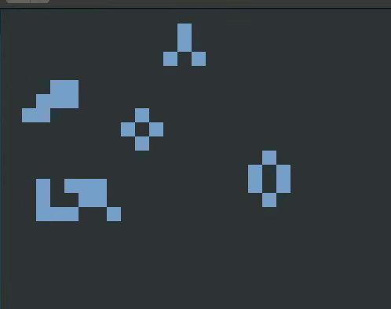

  <h2>SDL2 & Console</h2>
  
  
# Conway's Game of Life Development Techniques Project
> Conway's Game of Life  written in C using SDL2 for graphic rendering.This project runs both in console and with the help of SDL2.
## Installation
        Libraries for installation before running project:
        sudo apt update && sudo apt-get install libcunit1 libcunit1-doc libcunit1-dev libsdl2-2.0 gcovr cmake  doxygen

## Branches and Tags
6 versions of project exists:
Tags: Branches
- v1.0 : step1 - to develop a first version of a code to visualize the Game of Life in console with ansi.
- v2.0 : step2 - Split development and implement CMake instead of make
- v3.0 : step3 - New version of game developed. Now Game can be played clipped and circular modes.
- v4.0 : step4 - Implementing SDL2 library for graphical rendering.
- v5.0 : step5 - Adding Unit tests for project with help of CUnit library.
- NaN : master- Continuous integration added and step5 branch merged to master. 

### Standard rules:
- Any live cell with fewer than two live neighbours dies, as if caused by under- population.
- Any live cell with two or three live neighbours lives on to the next generation.
- Any live cell with more than three live neighbours dies,as if by over-population.
- Any dead cell with exactly three live neighbours becomes a live cell, as if by reproduction.

### Options
 When running program:
 - Do you want to display in Console => 1 or SDL2 => 2?
 1 for running in Console
 2 for running in SDL2
 - Clipped=1   or Circular=2
 1 for Clipped version
 2 for Circlar version 

## Usage
- git clone https://github.com/raminafandi/Game_of_Life_DT.git
- cd Game_of_Life_DT
- mkdir build
- cd build
- cmake ../
- make
- make docs - for creating doxygen
- make dist - for compressing source
- make cover_html - for showing coverage report
- ./Game_of_Life_DT - for running program
- ./unit_testing - for running unit tests
